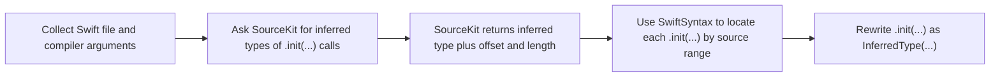

## Introduction

Swift's `.init(...)` shorthand is convenient. It keeps call sites short, avoids repeating type names that already feel obvious, and arguably makes Swift code nicer to read.

But this convenience is not always free.

In large Swift codebases, `.init(...)` can show up thousands of times. Some of those call sites are harmless. Some are not.

## Type inference

Swift’s [diagnostic architecture overview](https://www.swift.org/blog/new-diagnostic-arch-overview/#type-inference-overview) explains the constraint-based type checker well, so I will not repeat the full model here.

In short, type inference is how a compiler figures out the type of an expression from context.

```swift
struct ViewModel {
    let value: String
}

func render(_ model: ViewModel) {}

render(.init(value: "Hello")) // .init(value:) is inferred as ViewModel
```

There is no `ViewModel` written at the call site. A human can still read this and understand that `.init(value:)` means `ViewModel(value:)`, because `render` takes a `ViewModel`.

The compiler has to prove the same thing.

Swift’s type inference is one of the things that makes the language pleasant to use. But inference can have a compile-time cost.

## The problem

In the project I was working on, one specific `.init(...)` pattern appeared thousands of times, and type-checking diagnostics showed that the compiler was spending noticeable time on that expression shape.

The goal was simple: make those initializer calls explicit where inference was costing us time.

```swift
// Simplified example of what we want to achieve
// Before
doSomething(model: .init(value: "1"))

// After
doSomething(model: Test.ViewModel(value: "1"))
```

A plain search and replace would not work. Each `.init(...)` call can resolve to a different type, and that type is not written anywhere at the call site.

But the type information already exists somewhere in the compiler tooling.

If we can extract the resolved type for each expression, we can match that information back to the `.init(...)` call in the source file and rewrite the call explicitly.

## A small benchmark

Before building a rewrite tool, I wanted a smaller benchmark that could reproduce the same kind of type-checking behavior.

I created a small benchmark repo, [swift-type-checking-benchmarks](https://github.com/kaanbiryol/swift-type-checking-benchmarks), where different expression shapes can be generated and measured. The benchmark creates repeated Swift files and runs `xcrun swiftc -typecheck` through [`hyperfine`](https://github.com/sharkdp/hyperfine).

One example is a small overloaded API:

```swift
struct IntBox {
    let value: Int
}

struct ShortBox {
    let value: Int
}

struct DecimalBox {
    let value: Int
}

func read(_ box: IntBox) -> Int {
    box.value
}

func read(_ box: ShortBox) -> Int16 {
    Int16(box.value)
}

func read(_ box: DecimalBox) -> Double {
    Double(box.value)
}
```

Then compare this:

```swift
let total =
    read(.init(value: 1))
    + read(.init(value: 2))
    + 1
```

With this:

```swift
let total =
    read(IntBox(value: 1))
    + read(IntBox(value: 2))
    + 1
```

Both snippets compile. The important detail is that `total` has no explicit type annotation, so the compiler has to infer the initializer target type and the expression result together.

In the `.init(...)` version, each initializer starts without a concrete target type. The compiler has to resolve the overloaded `read` calls and the surrounding `+` expression together before it can settle on `IntBox`.

In the explicit version, `IntBox(...)` gives the solver the argument type immediately. That lets it discard the `ShortBox` and `DecimalBox` overloads much earlier.

In one local run with 300 repeated calls on Swift 6.3, the explicit version was faster:

```text
explicit IntBox(...): 321.5 ms
shorthand .init(...): 1.227 s
```

That is about `3.82x` faster in that run. The benchmark is intentionally small, but it captures the shape of the issue.

This does not mean explicit initializers are always `3.82x` faster. There are cases where `.init(...)` is harmless, or even faster. The useful takeaway is to measure your own expression shapes.

## The solution

Once the pattern was measurable, the next step was to build a tool that could automate the rewrite.

This is where [SourceKit](https://github.com/swiftlang/swift/blob/main/tools/SourceKit) becomes useful. SourceKit can report expression type information when it receives the same compiler arguments that the project uses to build the file.

At a high level, this tool does three things:

1. Collect the compiler arguments the project uses.
2. Ask SourceKit for expression type information using those arguments.
3. Use SwiftSyntax to rewrite only the `.init(...)` call sites that can be matched safely.



### 1. Grabbing compiler arguments

SourceKit needs the same compiler context as the project. Otherwise, it may not be able to resolve the expression types correctly.

That means the right SDK, architecture, build configuration, search paths, module maps, package products, generated sources, and target-specific settings.

In an Xcode project, the most practical source of those arguments was the indexing build settings:

```sh
xcodebuild \
  -workspace App.xcworkspace \
  -scheme App \
  -arch arm64 \
  -sdk iphonesimulator \
  -showBuildSettingsForIndex \
  -json
```

From that JSON, the tool reads `swiftASTCommandArguments` for each file and passes them to the SourceKit request.

### 2. SourceKit requests

SourceKit is request-based. For this tool, the important request is the [Expression Type request](https://github.com/swiftlang/swift/blob/main/tools/SourceKit/docs/Protocol.md#expression-type), which returns type information for expressions in a Swift file.

For a Swift file containing a call like this:

```swift
doSomething(model: .init(value: "1"))
```

a simplified expression-type request looks like this:

```yaml
key.request: source.request.expression.type
key.sourcefile: '/path/File.swift'
key.compilerargs: # Compiler arguments collected in the previous step
  - '-sdk'
  - '/path/to/sdk'
  - '/path/File.swift'
key.fully_qualified: true
```

The response can include the resolved expression type, together with the source range it applies to:

```json
{
  "key.expression_type_list": [
    {
      "key.expression_offset": 19,
      "key.expression_length": 17,
      "key.expression_type": "Test.ViewModel"
    }
  ]
}
```

That is the key piece of information the tool needs. At offset `19`, the inferred `.init(...)` call resolves to `Test.ViewModel`, so the tool can replace it with an explicit initializer call.

### 3. Rewriting with SwiftSyntax

[SwiftSyntax](https://github.com/swiftlang/swift-syntax) handles the source editing step. SourceKit gives us resolved expression types at byte offsets, but it does not tell us to replace text blindly. We still need to verify that the code at that position is the syntax pattern we want to rewrite.

The tool parses the Swift file, walks the syntax tree, and looks for prefix-dot initializer calls: `.init(...)`.

For each match, it checks whether SourceKit resolved a concrete type at that position. If it did, the tool rewrites the initializer from inferred form to explicit form:

```swift
// Before
doSomething(model: .init(value: "1"))

// After
doSomething(model: Test.ViewModel(value: "1"))
```

That split is what makes the approach safe enough to run over a larger codebase.

SourceKit provides compiler-derived type information. SwiftSyntax makes sure the edit lands on the right Swift syntax instead of treating the file as plain text.

If the tool cannot confidently match a SourceKit result to a `.init(...)` syntax node, it skips that call site instead of guessing.

### The edge cases

SourceKit does not always return types in the form you would write in source code.

For example, this call site looks straightforward:

```swift
func doSomethingOptional(model: Test.ViewModel?) {}

doSomethingOptional(model: .init(value: "2"))
```

The type you want to insert is `Test.ViewModel`:

```swift
doSomethingOptional(model: Test.ViewModel(value: "2"))
```

But the surrounding expression is optional. In my cases, SourceKit commonly returned this as:

```swift
Test.ViewModel?
```

That is useful information, but `Test.ViewModel?` is not what you want to put before an initializer call. The tool strips the optional marker before rewriting the code. A more complete normalizer should also handle forms like `Optional<Test.ViewModel>`.

Arrays have a similar problem. In array literals, SourceKit can return something like:

```swift
Array<Test.ViewModel>.ArrayLiteralElement
```

Again, that means something to the compiler, but it is not a type name you would write at the call site. The tool detects this array-literal form and turns it back into `Test.ViewModel`.

For example, the sample project in [`init-revise-cli`](https://github.com/kaanbiryol/init-revise-cli) has cases like this:

```swift
doSomethingArrayOptional(model: [
    .init(value: "6"),
    .init(value: "7"),
    nil
])
```

The output should be explicit, but still look like normal Swift:

```swift
doSomethingArrayOptional(model: [
    Test.ViewModel(value: "6"),
    Test.ViewModel(value: "7"),
    nil
])
```

I am sure there are more edge cases. Optionals and arrays were just the first ones I ran into.

## Not just initializers

I focused on `.init(...)` in this post because that was the repeated pattern in front of me. But the underlying problem is not specific to initializers.

Any expression that leaves the compiler with too much ambiguity can create similar work.

The same approach still applies:

1. Measure slow expression shapes.
2. Find the repeated pattern.
3. Use SourceKit to grab explicit type information.
4. Replace with explicit types.

## The example project

The [init-revise-cli repo](https://github.com/kaanbiryol/init-revise-cli) includes a small [`Example/`](https://github.com/kaanbiryol/init-revise-cli/tree/main/Example) project that shows how everything comes together.

The public version is intentionally small. It demonstrates the SourceKit + SwiftSyntax flow without trying to cover every shape from a production codebase.

## Was it worth it?

In the project I was working on, this gave us around a 5% improvement on the measured build path, roughly 30 seconds.

That is not enough to make this a universal recommendation. But for a repeated source-level pattern that was already visible in slow type-checking diagnostics, it was enough to justify the tooling.

## Tips

Before rewriting anything, measure where the compiler is spending time. The slow type-checking flags are still practical tools for this.

Swift compiler has [frontend flags](https://github.com/swiftlang/swift/blob/main/include/swift/Option/FrontendOptions.td) for slow type-checking diagnostics:

```sh
-Xfrontend -warn-long-expression-type-checking=100
-Xfrontend -warn-long-function-bodies=100
```

After enabling the warnings, run your build and look for repeated slow expression shapes. If the same pattern appears many times, that is when targeted tooling starts to make sense.

## References

- [Swift.org: New Diagnostic Architecture Overview](https://www.swift.org/blog/new-diagnostic-arch-overview/#type-inference-overview)
- [Swift language reference: Type Inference](https://github.com/swiftlang/swift-book/blob/main/TSPL.docc/ReferenceManual/Types.md#type-inference)
- [Swift compiler frontend options](https://github.com/swiftlang/swift/blob/main/include/swift/Option/FrontendOptions.td)
- [SourceKit protocol: Expression Type](https://github.com/swiftlang/swift/blob/main/tools/SourceKit/docs/Protocol.md#expression-type)
- [SwiftSyntax](https://github.com/swiftlang/swift-syntax)
- [swift-type-checking-benchmarks](https://github.com/kaanbiryol/swift-type-checking-benchmarks)
- [init-revise-cli](https://github.com/kaanbiryol/init-revise-cli)
